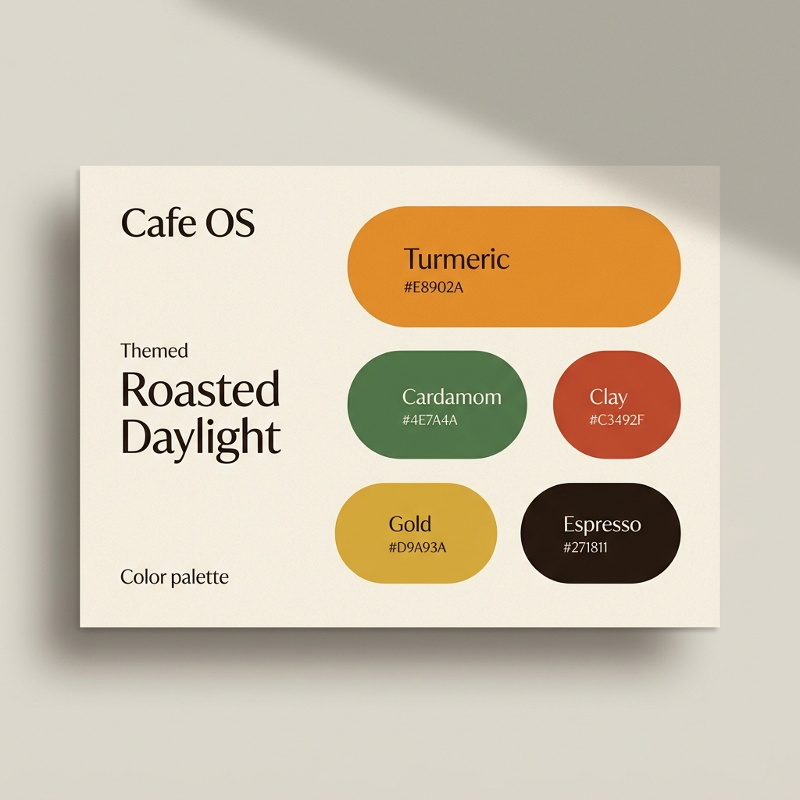

# Cafe OS Brand Identity & Color Palette

This document defines the branding color palette and visual design system for **Cafe OS**, themed **"Roasted Daylight"**.

## Visual Brand Concept
Cafe OS features a warm, premium Indian-cafe identity. The palette is carefully selected to evoke the sensory experience of a high-end coffee shop:
*   **Warm Paper Backgrounds** that feel organic and tactile.
*   **Espresso-toned Text & Borders** replacing harsh pure blacks.
*   **Turmeric & Cardamom Accents** bringing in traditional Indian warmth and freshness.
*   **Rose-Clay & Gold** highlighting achievements, celebrations, and customer loyalty.

---

## Brand Palette Card

---

## Detailed Specifications

### Core Base Colors
Used for backgrounds, text, and structural container outlines to establish a warm, organic visual tone.

| Swatch | Name | Variable | Hex Code | Usage |
| :--- | :--- | :--- | :--- | :--- |
| 🟨 | Paper | `--paper` | `#F6EFE3` | Warm cream background |
| 🟨 | Paper 2 | `--paper-2` | `#FBF6EC` | Card and component surfaces |
| 🟨 | Paper 3 | `--paper-3` | `#FFFDF8` | Highlighted cards/active elements |
| 🟫 | Espresso (Ink) | `--ink` | `#271811` | Primary text and major labels |
| 🟫 | Espresso (Ink 2) | `--ink-2` | `#5B4636` | Secondary body / descriptive text |
| 🟫 | Espresso (Ink 3) | `--ink-3` | `#9A8473` | Disabled labels / placeholder text |
| 🟨 | Line | `--line` | `#E4D7C3` | Light borders and dividers |
| 🟨 | Line 2 | `--line-2` | `#D8C7AD` | Accent borders and active dividers |

### Brand Accent Palette
Dynamic accents that bring energy, highlight key actions, and define specific features of Cafe OS.

| Swatch | Name | Variable | Hex Code | Primary Brand Role |
| :--- | :--- | :--- | :--- | :--- |
| 🟧 | **Turmeric** | `--turmeric` | `#E8902A` | **Primary Brand Color** - Call-to-actions, buttons, highlighting |
| 🟩 | **Cardamom** | `--cardamom` | `#4E7A4A` | **Secondary Brand Color** - Statuses, green highlights, fresh vibes |
| 🟥 | **Clay** | `--clay` | `#C3492F` | **Celebration / Alerts** - Rewards, rose-clay badges, errors |
| 🟪 | **Berry** | `--berry` | `#8E3B6B` | **Gamification / Play** - Quick games, interactive components |
| 🟨 | **Gold** | `--gold` | `#C99A2E` | **Loyalty / Premium** - VIP statuses, customer points, special tiers |

---

## Dark Roast Skin (KDS Mode)
For the Kitchen Display System (KDS) or low-light scenarios, the core surfaces shift to deep, roasted dark tones:

*   **Dark Background** (`--paper`): `#16110D`
*   **Dark Card Surface** (`--paper-2`): `#211913`
*   **Highest Dark Surface** (`--paper-3`): `#2B201A`
*   **Light Cream Text** (`--ink`): `#F4E9DA`
*   **Muted Light Text** (`--ink-2`): `#C2AC97`
