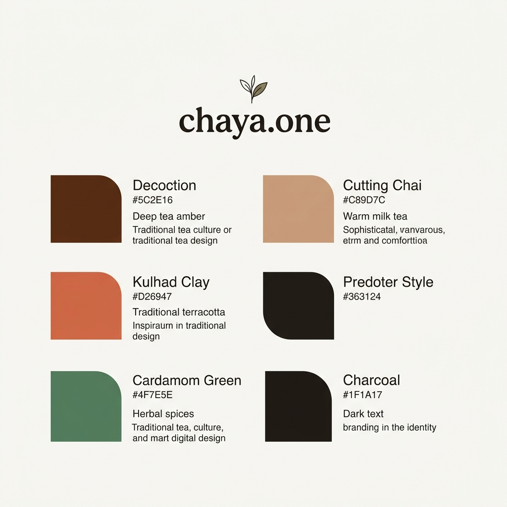

# chaya.one — Brand Identity & Color Palette

This document defines the branding color palette and visual design system for **chaya.one**, the SaaS platform for modern tea shops and cafes.

## The Brand Concept
**chaya.one** is rooted in the rich, sensory culture of tea (Chaya/Chai). The identity captures the warmth of brewing, the comfort of milk tea, the earthiness of clay cups, and the freshness of natural spices:
*   **Decoction & Milk Tea** tones forming the core primary and secondary interface colors.
*   **Kulhad Clay & Cardamom** acting as lively, natural accents for key details.
*   **Milky White & Charcoal** establishing high-contrast, clean base surfaces.

---

## Brand Palette Card

---

## Detailed Specifications

### Base Colors

| Swatch | Name | Hex Code | Description / Usage |
| :--- | :--- | :--- | :--- |
| 🥛 | Milky White | `#FAF8F5` | Primary background color; clean, warm, milk-froth white |
| 🟫 | Charcoal | `#1F1A17` | Primary text and major labels; deep tea-leaf charcoal |
| 🟨 | Paper Cream | `#F4EFEA` | Secondary background / Card container fill |
| 🟨 | Border Line | `#E2DCD5` | Soft borders and divider lines |

### Accent Colors

| Swatch | Name | Hex Code | Brand Role & Meaning |
| :--- | :--- | :--- | :--- |
| 🟫 | **Decoction** | `#5C2E16` | **Primary Brand Color** - Represents strong brewed black tea. Used for primary buttons, core headers, and active states. |
| 🟧 | **Cutting Chai** | `#C89D7C` | **Secondary Brand Color** - Represents warm, comforting milk tea. Used for secondary actions, sub-headers, and background tints. |
| 🟧 | **Kulhad Clay** | `#D26947` | **Highlight Accent** - Terracotta orange-brown of traditional clay cups. Used for rewards, special badges, and attention-grabbing tags. |
| 🟩 | **Cardamom Green**| `#4F7E5E` | **Success / Accent** - Represents fresh green cardamom pods. Used for positive actions, success notifications, and green accents. |
| 🟨 | **Golden Honey** | `#E2A93E` | **Loyalty / Premium Accent** - Deep amber honey. Used for premium tiers, points balance, and loyalty badges. |
